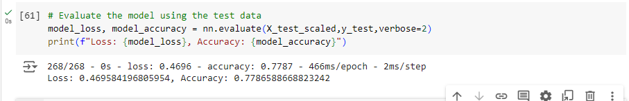

# deep-learning-challenge

Module 21 Challenge Assignment

# Overview

Alphabet Soup is a non-profit organisation and they are looking for a tool that can help them predict the best applications for funding based on prior data. 

This model will use a neural network machine learning algorithm to predict whether applicants will be successful or not. 

The data is provided in CSV format and contains more than 34,000 organisations that have previously recieved funding. 

A number of example columns is provided below:

EIN and NAME — Identification columns
APPLICATION_TYPE — Alphabet Soup application type
AFFILIATION — Affiliated sector of industry
CLASSIFICATION — Government organisation classification
USE_CASE — Use case for funding
ORGANIZATION — Organisation type
STATUS — Active status
INCOME_AMT — Income classification
SPECIAL_CONSIDERATIONS — Special considerations for application
ASK_AMT — Funding amount requested
IS_SUCCESSFUL — Was the money used effectively

# Data Preprocessing

Preprocessing the csv data involved importing the charity_data.csv into Pandas and initially dropping the EIN and NAME columns. 
From here, the target variable 'IS_SUCCESSFUL' was identified and this tells us whether the money has been used effectively.

Features varaibles are all the other columns except 'IS_SUCCESSFUL'

# Compiling, Training, and Evaluating the Model

Many different variations were tried to get the accuracy of this model above 75% but this proved futile. Extra hidden layers were added, activation functions changed (eg Tanh instead of Sigmoid), number of nuerons altered but this all yeilded a similar result of 72.4%.

The target was acheived when 'NAME' was added back into the dataframe. Initially, adding this back into the dataframe crashed Google Colab as there were too many 'NAME's so a filter was applied which binned the value counts of 'NAMES' into "other" with less than 10 occurences.

# Best Results

The best results were accompanied with the following hidden layers and neuron counts:
HL1 - Input_dim = 263, Activation Function = 'relu'
HL2 - Input_dim = 128, Activation Function = 'relu'
Output - Input_dim = 1, Activation Function = 'sigmoid'

This result yeilded a 77.8% accuracy and a loss of 46.9%

